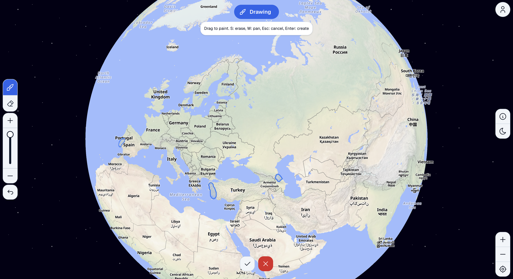

# Cultures.today

An interactive web application for exploring and documenting cultures around the world through an interactive map interface.



## Overview

Cultures.today enables users to discover cultures plotted on a world map, view detailed information including languages and multimedia content, and contribute their own cultural knowledge by drawing geographic boundaries and submitting culture data.

## Features

- **Interactive World Map** - MapLibre GL-based globe with culture boundaries overlaid
- **Boundary Drawing Tool** - Draw custom geographic boundaries using a brush tool with add/erase modes and adjustable size
- **Culture Details** - View languages, phrases with audio, flags, and multimedia content
- **Culture Submission** - Multi-step wizard for submitting new cultures with validation
- **Google Authentication** - OAuth login for user accounts and submissions
- **Spatial Queries** - PostGIS-powered queries to find cultures at any map location

## Tech Stack

**Frontend:**
- Next.js 16 (App Router)
- React 19
- Mantine 8 (UI components)
- MapLibre GL (mapping)
- Zustand (state management)
- Tailwind CSS 4

**Backend:**
- Next.js API Routes
- Prisma 7 with PostgreSQL
- PostGIS (geospatial)
- MinIO (S3-compatible storage)
- NextAuth (authentication)

## Prerequisites

- Node.js 20+
- Docker & Docker Compose
- PostgreSQL with PostGIS (or use Docker)

## Installation

```bash
# Install dependencies
npm install

# Copy environment template
cp .env.example .env.local
```

Configure `.env.local` with your credentials:
- Google OAuth (GOOGLE_CLIENT_ID, GOOGLE_CLIENT_SECRET)
- NextAuth secret
- Database URL
- MinIO credentials

## Development

```bash
# Start database and MinIO
docker-compose up -d

# Run migrations
npm run db:migrate

# Start development server
npm run dev
```

Open [http://localhost:3000](http://localhost:3000)

## Database Commands

```bash
npm run db:migrate   # Run migrations
npm run db:reset     # Reset database
npm run db:generate  # Generate Prisma client
npm run db:studio    # Open Prisma Studio
```

## Production

```bash
# Build
npm run build

# Start
npm start

# Or with Docker
docker-compose -f docker-compose.prod.yml up -d
```

## Project Structure

```
src/
├── app/
│   ├── api/           # API routes (auth, cultures, upload)
│   ├── page.tsx       # Home page with map
│   └── layout.tsx     # Root layout
├── components/
│   ├── map/           # Map and drawing components
│   ├── culture/       # Culture modal and submission wizard
│   ├── controls/      # UI controls
│   └── providers/     # Context providers
├── lib/               # Database, auth, storage utilities
├── stores/            # Zustand state stores
└── types/             # TypeScript types
prisma/
├── schema.prisma      # Database schema
└── migrations/        # Database migrations
```

## Environment Variables

| Variable | Description |
|----------|-------------|
| `DATABASE_URL` | PostgreSQL connection string |
| `GOOGLE_CLIENT_ID` | Google OAuth client ID |
| `GOOGLE_CLIENT_SECRET` | Google OAuth client secret |
| `NEXTAUTH_SECRET` | NextAuth encryption secret |
| `NEXTAUTH_URL` | Application URL |
| `NEXT_PUBLIC_MAP_STYLE` | MapLibre style URL |
| `MINIO_ENDPOINT` | MinIO server endpoint |
| `MINIO_ACCESS_KEY` | MinIO access key |
| `MINIO_SECRET_KEY` | MinIO secret key |

## License

MIT
